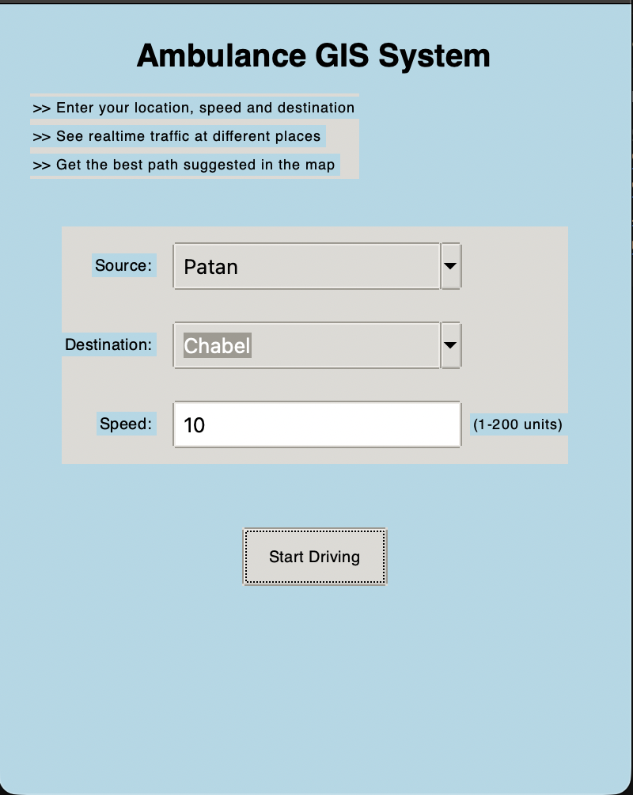
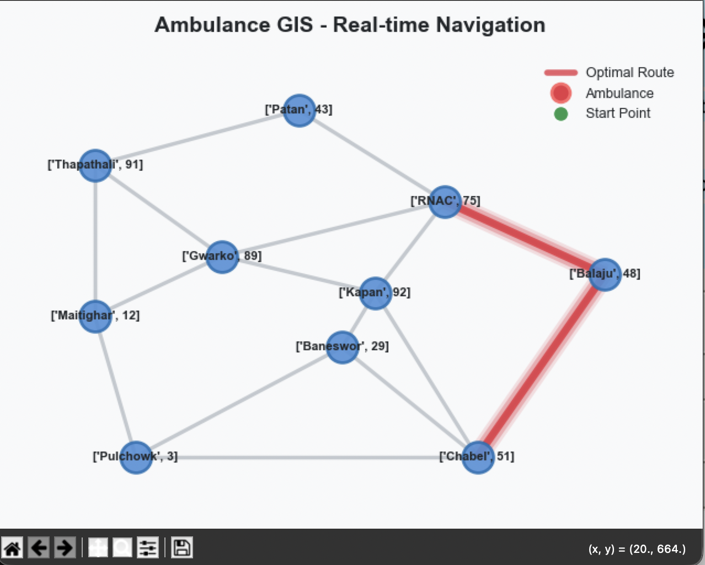

# Ambulance GIS System

A real-time simulation system for finding optimal ambulance routes based on distance and traffic conditions.

## Overview

This application demonstrates how an emergency vehicle can be guided to take the best path to reach its destination. The simulation considers both distance and traffic congestion at each junction to calculate optimal routes dynamically.

## Features

- Real-time traffic congestion visualization
- Dynamic path recalculation based on current conditions
- Interactive GUI for selecting source and destination
- Visual simulation of ambulance movement

## Requirements

- Python 3.8+

## Installation

### Using pip (recommended)

```bash
pip install -e .
```

### Using requirements file

```bash
pip install -r requirements.txt
```

## Usage

### Run the application

```bash
python main.py
```

### Alternative methods

```bash
# As a module
python -m ambulance_gis

# If installed via pip
ambulance-gis
```

## Development

### Setup

```bash
# Clone the repository
git clone https://github.com/Urmila-m/Ambulance-GIS-System.git
cd Ambulance-GIS-System

# Create virtual environment
python -m venv venv
source venv/bin/activate  # Windows: venv\Scripts\activate

# Install dev dependencies
pip install -r requirements-dev.txt
```

### Commands

| Command | Description |
|---------|-------------|
| `black ambulance_gis/` | Format code |
| `isort ambulance_gis/` | Sort imports |
| `flake8 ambulance_gis/` | Check code style |
| `mypy ambulance_gis/` | Type checking |
| `pytest` | Run tests |

## Project Structure

```
Ambulance-GIS-System/
├── ambulance_gis/           # Main package
│   ├── __init__.py
│   ├── __main__.py          # Module entry point
│   ├── core/                # Business logic
│   │   ├── ambulance.py     # Ambulance pathfinding
│   │   ├── road_map.py      # Road network
│   │   └── simulation.py    # Simulation environment
│   ├── ui/                  # User interface
│   │   └── main_window.py   # Main window
│   ├── utils/               # Utilities
│   │   ├── geometry.py      # Distance calculations
│   │   ├── validators.py    # Input validation
│   │   └── logger.py        # Logging
│   └── visualization/       # Visualization
│       └── map_renderer.py  # Map rendering
├── data/                    # Data files
│   ├── points.csv           # Node data
│   └── roads.csv            # Road data
├── config.py                # Configuration
├── main.py                  # Entry point
├── requirements.txt         # Dependencies
├── requirements-dev.txt     # Dev dependencies
└── pyproject.toml           # Project metadata
```

## Screenshots




### Quantum Hack - Health and Urban Population Management
